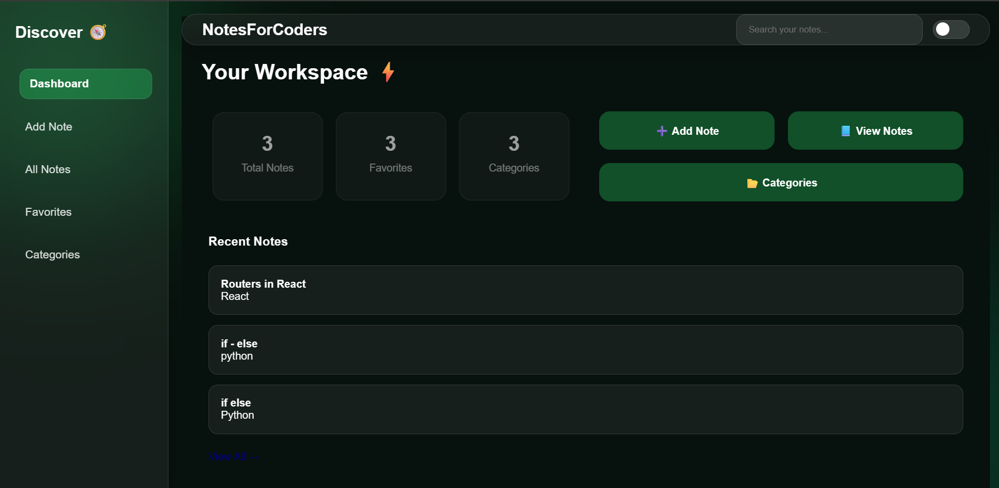
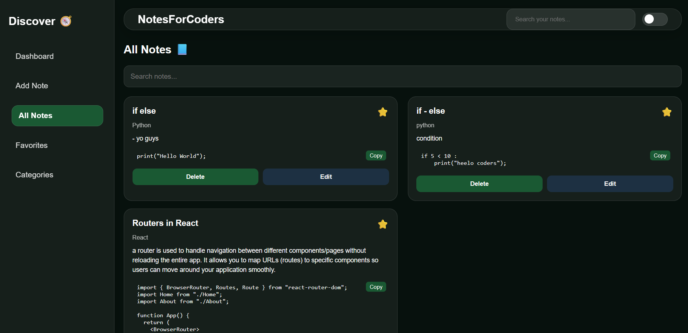
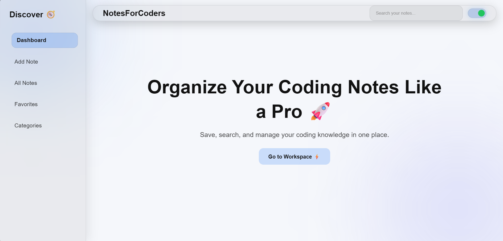

# 🚀 NotesForCoders

A modern coding notes application built with React + Vite for developers who want to organize programming knowledge in a clean, structured, and beautiful way.

---

## 🌟 About The Project

As a student learning React and frontend development, I wanted to build something that was not just another tutorial project.

I wanted to create something meaningful — something I could actually use daily while learning programming.

While studying JavaScript, React, Git, MongoDB, CSS, and other technologies, I noticed one big problem:

> My coding notes were scattered everywhere.

Some were inside WhatsApp chats, some in notebooks, some in random text files, and some were completely lost.

So I decided to build **NotesForCoders** — a personal knowledge management app specially designed for coders.

This project started as a learning journey while exploring React, component architecture, responsive design, animations, UI/UX improvements, and real-world frontend structure.

Now it has evolved into a complete coding notes workspace with:

- Structured note organization
- Smart searching
- Categories
- Favorites
- Code snippets
- Responsive modern UI
- Beautiful dashboard experience

And this is just the beginning.

---

# ✨ Features

## 📘 Smart Notes System
- Create coding notes
- Save descriptions
- Save code snippets
- Edit notes anytime
- Delete notes
- Favorite important notes

---

## 🔍 Smart Search
Search notes instantly by:
- Title
- Description
- Category
- Code snippets

---

## 📂 Categories
Organize notes by technologies:
- React
- JavaScript
- HTML
- CSS
- Git
- LocalStorage
- and more...

---

## 🖥️ Full Screen Note Modal
Expand any note into a distraction-free reading mode for better focus and readability.

---

## 🌙 Dark / Light Mode
Beautiful theme switching with modern UI styling.

---

## 📱 Fully Responsive
Optimized for:
- Desktop
- Tablet
- Mobile devices

---

## 🎨 Modern UI/UX
Built with:
- Glassmorphism effects
- Smooth hover animations
- Framer Motion animations
- Interactive dashboard sections

---

# 🛠️ Tech Stack

## Frontend
- React
- Vite
- React Router DOM
- Framer Motion
- CSS3

---

# 📸 Screenshots

## 🏠 Dashboard


---

## 📘 All Notes


---

## Light Mode


---

# 📂 Project Structure

```bash
src/
│
├── components/
│   ├── Dashboard/
│   ├── HomeSections/
│   ├── Navbar/
│   ├── NoteCard/
│   ├── NoteModal/
│   └── Sidebar/
│
├── pages/
│   ├── AddNote/
│   ├── AllNotes/
│   ├── Categories/
│   ├── EditNote/
│   └── Favorites/
│   └── Home/
│
└── App.jsx
└── index.css
└── main.jsx